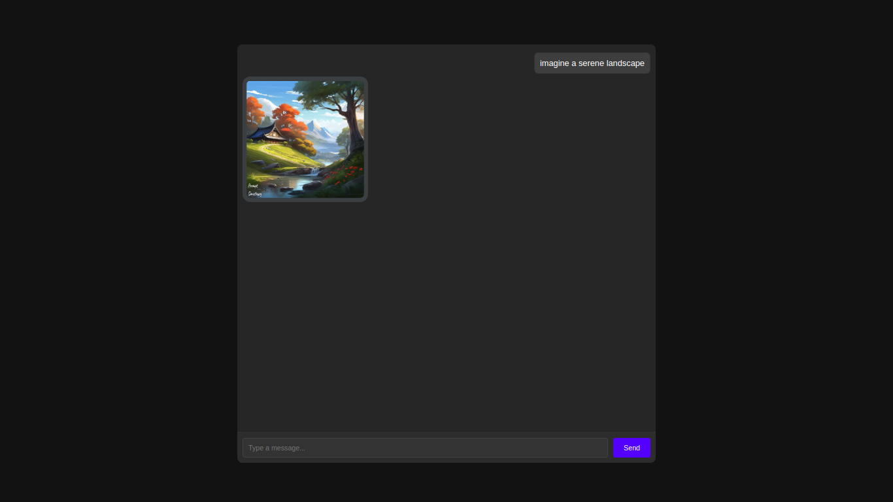

# Stability Chat Bot

**Overview:**

This Flask application serves as a chat bot interface integrated with an image generation feature. Users can interact with the chat bot, which responds using Gemini AI, a powerful language generation model. Additionally, users can generate images based on text prompts provided to the bot.

**Features:**

- **Chat Bot Interface:** Users can engage in conversations with the chat bot, which operates under the persona of "Frea," a friendly and intelligent AI assistant.
  
- **Image Generation:** Users can request the generation of images based on text prompts. The generated images are crafted using the Stability AI API, incorporating the provided prompt to create unique visuals.

- **Image Logging:** The application logs generated images, storing metadata such as filename and creation time in a SQLite database.

- **Security Measures:** The application includes security measures to prevent bot activity detection and incorporates safety settings to filter out harmful content in chat responses.

**Prerequisites:**

- Python 3.x installed on your system.
- Access to the Stability AI API for image generation.
- A Google Cloud Platform account with access to the Gemini AI API.
- Installation of necessary Python packages (specified in `requirements.txt`).

**Setup:**

1. Clone this repository to your local machine.
2. Install the required Python packages using `pip install -r requirements.txt`.
3. Obtain API keys for the Stability AI API and the Gemini AI API.
4. Create a `.env` file in the web directory and add the API keys:

    ```text
    STABILITY_API_KEY=your_stability_api_key
    GEMINI_API_KEY=your_gemini_api_key
    ```

**Usage:**

1. Navigate to the web directory.
2. Run the Flask application by executing `python app.py` in the terminal.
3. Access the application in your web browser by navigating to `http://localhost:2500`.
4. Interact with the chat bot by typing messages in the input field and pressing "Send".
5. To generate an image, start your message with "imagine" followed by a prompt (e.g., "imagine a serene landscape").
6. The generated images will be displayed in the chat interface, and metadata will be logged in the database.

Below is a screenshot of how the application interface may look while running:



**Additional Notes:**

- The application includes a mechanism to delete old images from both the filesystem and the database to manage storage efficiently.
- Customize the chat bot's behavior, appearance, and personality by modifying the `response.py` and `iresponse.py` files.
- Further enhancements and integrations, such as user authentication and persistent user sessions, can be implemented to extend the application's functionality.

**Contributing:**

Contributions to this project are welcome. Please submit pull requests or open issues for any improvements, bug fixes, or feature requests.

**License:**

This project is licensed under the MIT License. See the `LICENSE` file for more details.
